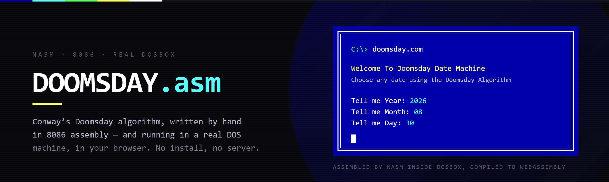

<p align="center">
  
</p>

<p align="center">
  <a href="https://hammadshakeelai.github.io/Doomsday-Algorithm-In-Assembly-Language/doomsday.html"></a>
  <a href="https://hammadshakeelai.github.io/Doomsday-Algorithm-In-Assembly-Language/ide.html"></a>
</p>

<p align="center">
  
  
  
  
</p>

# Doomsday algorithm, implemented in assembly language by hand from scratch

Conway's Doomsday algorithm — the trick for working out the weekday of any date
in your head — written as 480 lines of 8086 assembly. No libraries, no runtime,
no framework. Just `org 100h`, `int 21h`, and arithmetic done by hand.

**Along with it, a website that live-demonstrates the program running.** Real
DOSBox compiled to WebAssembly, with real NASM installed inside it. Your source
is written into the emulated filesystem, assembled with `nasm -f bin`, and the
resulting `.COM` is executed — in the browser, with nothing installed and no
server anywhere.

## Try it

| | |
|---|---|
| **[▶ Watch it run](https://hammadshakeelai.github.io/Doomsday-Algorithm-In-Assembly-Language/doomsday.html)** | The finished program. Source read-only on the left, a live DOS screen on the right, a debug panel underneath. It assembles the moment the page loads — click the screen and type a date. |
| **[Write your own](https://hammadshakeelai.github.io/Doomsday-Algorithm-In-Assembly-Language/ide.html)** | The same toolchain as a scratchpad. Type 8086 assembly, press Run, and NASM assembles it inside DOS exactly as it would on a real machine — errors, line numbers and all. |

> Because it is genuinely DOS and genuinely NASM, anything that works here works
> in a real DOSBox. It is a faster way to run the same toolchain, not a
> simulation of it.

## The algorithm

Every year has a weekday — its *doomsday* — that a set of easy-to-remember dates
all fall on: **4/4, 6/6, 8/8, 10/10, 12/12**, and the last day of February. Find
that one weekday for the year and any date is a short hop from the nearest
anchor.

It is designed to be done in your head. Doing it in 8086 assembly means doing
the division yourself — `div bl`, remainder in `AH`, and no help from anyone.

The same algorithm was implemented in C++ first; that version and a longer
explanation of the arithmetic live in the sibling
[Doomsday](https://hammadshakeelai.github.io/Doomsday/) project. This repository
is the third implementation.

## What is actually running

```
your source ──▶ prog.asm written into the DOS filesystem
                     │
                     ▼
              nasm -f bin -o prog.com -s      ← real NASM, inside real DOSBox
                     │
        diagnostics ─┴─▶ parsed → gutter markers, and the program is not run
                     │ ok
                     ▼
                 prog.com executes
                     │  int 21h AH=09h/02h ──▶ the screen
                 keystrokes ──▶ int 21h AH=01h/0Ah
```

Everything is static. No backend, no build step, no package manager, no
trackers, and nothing leaves your browser.

## Repository

```
docs/                  the GitHub Pages site — everything served lives here
├── index.html         landing page
├── doomsday.html      the showcase: read-only source + big DOSBox + debug panel
├── ide.html           the editable scratchpad
├── runner.html        one throwaway iframe per run (js-dos can't re-init twice)
├── asm/
│   ├── doomsday.asm   ← the project: the algorithm, in 8086 assembly
│   └── smoke.asm      toolchain fixture: prints, prompts, reads, echoes, exits
├── js/
│   ├── dosengine.js   the only module that knows js-dos exists
│   ├── nasm-errors.js pure diagnostic parser — no DOM, testable with node
│   ├── runlog.js      the assemble → run → exit phase machine
│   └── asm-view.js    read-only source viewer with gutter markers
├── css/vscode.css     the VS Code Dark+ chrome
└── vendor/            js-dos 8.4.1 (GPL-2.0) + NASM 2.16.03 DOS (BSD-2)

DESIGN.md              decisions, spike results, traps, and the NFRs
tools/                 node test for the diagnostic parser
```

**[DESIGN.md](DESIGN.md)** is worth reading if you care how this was built. It
records the decisions, the seven traps that cost real hours (js-dos cannot be
initialised twice in one document; never shell-redirect a DJGPP program; NASM's
errors need `-s` or a failed build reports success), the measured timings, and
the non-functional requirements — including two that are deliberately *not*
implemented, with reasons.

## Running it locally

No build step. Serve `docs/` and open it:

```bash
python -m http.server 8000 --directory docs
```

Then visit `http://localhost:8000`. The parser has a node test:

```bash
node tools/test-nasm-errors.js
```

> **If the DOS screen freezes, check the tab is in front.** js-dos drives the
> emulator from `requestAnimationFrame`, so a backgrounded tab stops the machine
> dead. It looks exactly like a hang, and it isn't one.

## Status

The toolchain is verified end to end: `doomsday.asm` assembles with zero NASM
errors, runs, and accepts typed input through all three prompts on desktop and
mobile.

**Known issue:** the program prints ` So on Year ` and then stops before
reporting the weekday — it reaches its century-anchor block and does not print
again. Tracked in [DESIGN.md](DESIGN.md#verified-by-hand-2026-08-30) with the
first place to look.

## Credits

Runs on [js-dos](https://js-dos.com/) (DOSBox, GPL-2.0) and
[NASM](https://www.nasm.us/) (BSD-2-Clause). Attribution in
[`docs/vendor/NOTICE.md`](docs/vendor/NOTICE.md).

Because this ships and runs js-dos, the repository is licensed **GPL-2.0** — see
[LICENSE](LICENSE).
